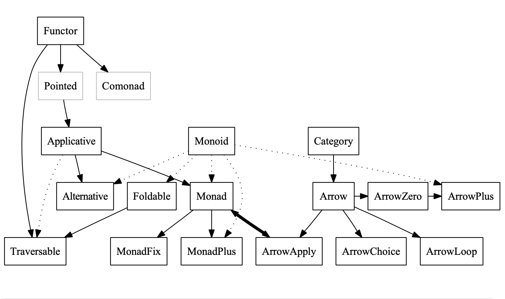

# data-ts

Common algebraic structures heavily inspired by Haskell typeclasses adapted for fluent [pointfree](https://wiki.haskell.org/Pointfree) interfaces in Typescript. Strictly typed.


Source: [The Typeclassopedia](https://wiki.haskell.org/wikiupload/8/85/TMR-Issue13.pdf) by Brent Yorgey

## Install

```sh
yarn add data-ts
```

## Import

```typescript
import { Maybe } from 'data-ts';
/* or */
import * as Maybe from 'data-ts/lib/Maybe';
```

## Run Test

```sh
$ yarn jest
$ yarn jest --watch
```

## Publish

```sh
$ yarn publish
```

## Instances

- [ ] Identity
- [X] Maybe
- [ ] Either
- [ ] Task
- [ ] List
- [ ] Map
- [ ] Set
- [ ] Trie


## Work in progress

- track 1:
  ```
  LazyMaybe
  ```
- track 2:
  ```
  List -- (Tree) -- (BinaryTree) -- (BST) -- (Red-Black Tree)
                 \_ (Stack)
                 \_ (Map)
  ```
- track 3:
  ```
  Trie -- (RouteTrie)
  ```
- track 4:
  ```
  Monad2 -- (Either)
  ```


## TODO Ideas

- create `Functor2`, `Applicative2`, `Monad2` to support `Either`
- implement `Alternative` (`.alt`), `Semigroup`, `Monoid`, `Foldable`, `Traversable`
- implement the lazy version of `Maybe`, `Either` that apply multiple chains/maps per item
- implement naive, non-persistent (but immutable) versions of: (Linked)List, Stack, Tree, Dictionary (still useful for small inputs)
- implement **persistent** versions of: LinkedList, Stack, Tree, Dictionary
- see if it's possible to implement `type Maybe<T> = Nothing | Just<T>;` rather than `type Maybe<T> = Nothing<T> | Just<T>;`


## References & Inspirations

- [`gcanti/fp-ts`](https://github.com/gcanti/fp-ts)
- [`sanctuary-js`](https://github.com/sanctuary-js)
- [`evilsoft/crocks`](https://github.com/evilsoft/crocks)
- [`funkia/jabz`](https://github.com/funkia/jabz)
- [`origamitower/folktale`](https://github.com/origamitower/folktale)
- [`ramda-fantasy`](https://github.com/ramda/ramda-fantasy)
- [`fluture-js`](https://github.com/fluture-js)
- [`fantasy-land`](https://github.com/fantasyland/fantasy-land)
- [`static-land`](https://github.com/rpominov/static-land)

Note: this project does not implemented to be in compliant with [Fantasyland](https://github.com/fantasyland/fantasy-land) but I draw a lot of inspiration from it. I however opt to be in consistent with Haskell interfaces but adapt it to be ergonomic in Typescript/Javascript.


## Brain dump

- semigroup/monoid is useful because it allows you to implement pairwise funtions/operators and they will just work on your monoid (e.g. list). With associativity and that allows divide & conquer algorithms, parallelization, and incremental accumulation.
- function composition can be a monoid if the functions have the same type of input and output (endomorphism)
- hence, a monad is just a monoid in the category of endofunctors

> A **functor** is a structure-preserving transformation between categories. It's some way to map objects from one category to objects of another category while also preserving the arrows between objects—think of it as a category homomorphism. ... An **endofunctor** is a functor from one category back to the same category.
https://www.quora.com/What-is-an-endofunctor

`fmap` (haskell) can be viewed as `fmap :: Functor f => (a -> b) -> (f a -> f b)` which shows the preserved structor that maps from `(a -> b)` into `(f a -> f b)`
